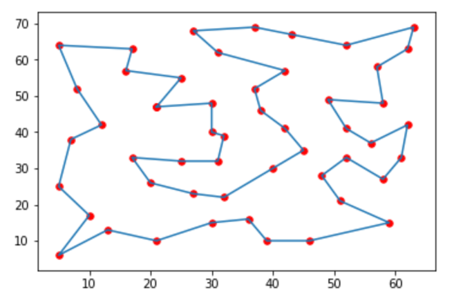
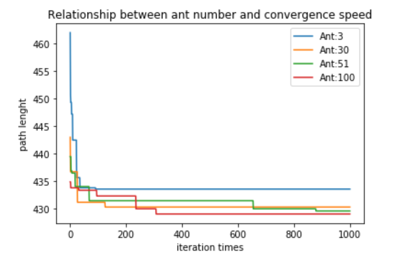
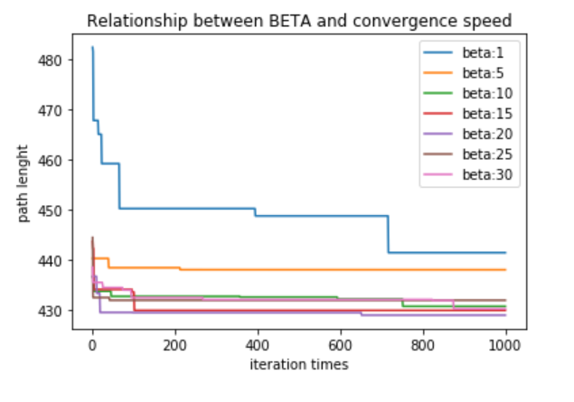
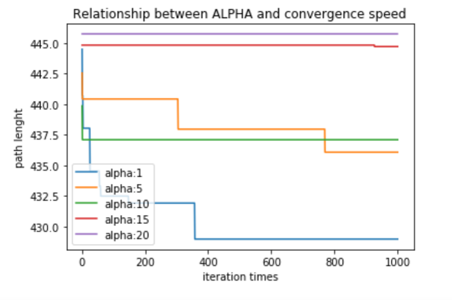

# 螞蟻演算法解旅行銷售員的問題
## ACO solves TSP problems

* ### 找到最好的解
  > Best Path : [5, 47, 22, 6, 42, 23, 13, 24, 12, 40, 39, 18, 41, 43, 14, 44, 32, 38, 9, 48, 8, 29, 33, 20, 49, 15, 1, 28, 19, 34, 35, 2, 27, 30, 25, 7, 21, 0, 31, 10, 37, 4, 36, 16, 3, 17, 46, 11, 45, 50, 26, 5] 
  
  上圖 _ACO找到的最佳路徑圖_ 
  
  >  * Shortest Path Length : 428.8717563920339

> 
> 螞蟻數量與收斂速度關係圖

>
>探討beta與收斂速度的關係

>
>探討alpha與收斂速度的關係
